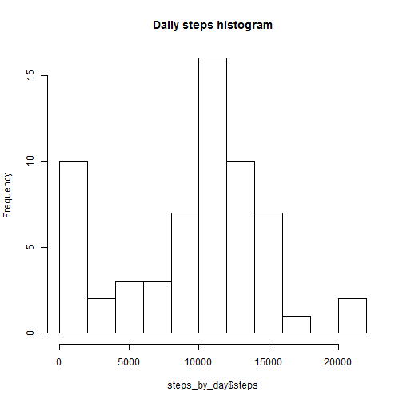
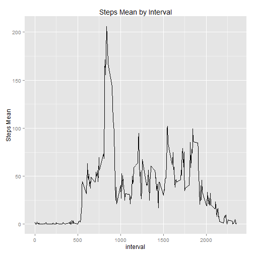
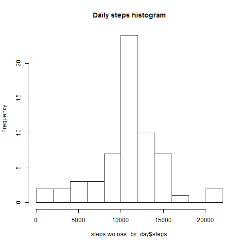
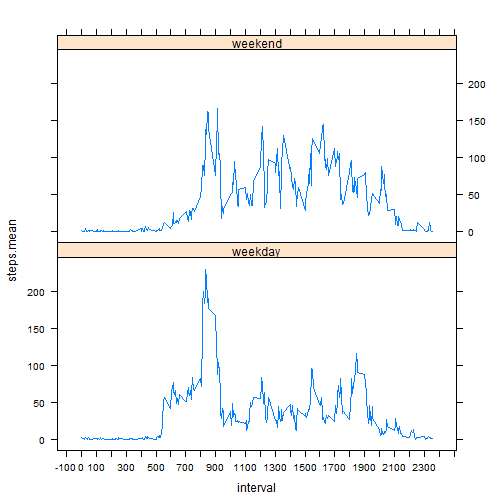

# Reproducible Research: Peer Assessment 1
This document represents a brief analysis, consisting from a sequence of questions based on personal movement data collected using activity monitoring devices such as a Fitbit, Nike Fuelband, or Jawbone Up.
These type of devices are part of the "quantified self" movement - a group of enthusiasts who take measurements about themselves regularly to improve their health, to find patterns in their behavior, or because they are tech geeks. But these data remain under-utilized both because the raw data are hard to obtain and there is a lack of statistical methods and software for processing and interpreting the data. 

## Loading and preprocessing the data
Load the dataset from a comma separated value file containing data from a personal activity monitoring device. This device collects data at 5 minute intervals through out the day. The data consists of two months of data from an anonymous individual collected during the months of October and November, 2012 and include the number of steps taken in 5 minute intervals each day.
The variables included in this dataset are:
1. steps: Number of steps taking in a 5-minute interval (missing values are coded as NA)
2. date: The date on which the measurement was taken in YYYY-MM-DD format
3. interval: Identifier for the 5-minute interval in which measurement was taken.It contains 2 parts: the 2 least significant digits represent minutes, whereas thousands and hundreds digits represent the hour.


```r
filename <- 'activity.csv'
df <- read.csv(filename)
```

## What is mean total number of steps taken per day?
Make a histogram of the total number of steps taken each day:

```r
library("ggplot2")
steps_by_day <-aggregate(df$steps, by=list(df$date), FUN=sum, na.rm=TRUE)
colnames(steps_by_day) <- c("day", "steps")
steps_by_day$day <- as.Date(steps_by_day$day)
hist(steps_by_day$steps, breaks=12, main="Daily steps histogram")
```

 

The daily steps evolution is presented in the following graphic:

```r
ggplot(steps_by_day, aes(x = day, y=steps))+ xlab("day") + ylab("Nb.Steps") + geom_line() +  
theme(axis.text.x = element_text(angle=90)) +  ggtitle("Steps by day")
```

 

Also the mean and median total number of steps taken per day:

```r
mean(steps_by_day$steps)
```

```
## [1] 9354
```

```r
median(steps_by_day$steps)
```

```
## [1] 10395
```


## What is the average daily activity pattern?
Make a time series plot (i.e. type = "l") of the 5-minute interval (x-axis) and the average number of steps taken, averaged across all days (y-axis):

```r
steps_by_5min_interval <-aggregate(df$steps, by=list(df$interval), FUN=mean, na.rm=TRUE)
colnames(steps_by_5min_interval) <- c("interval", "steps.mean")
ggplot(steps_by_5min_interval, aes(x = interval, y=steps.mean))+ xlab("interval") + ylab("Steps Mean") + geom_line() +  ggtitle("Steps Mean by Interval")
```

 

Which 5-minute interval, on average across all the days in the dataset, contains the maximum number of steps?

```r
max_steps.mean <- max(steps_by_5min_interval$steps.mean)
steps_by_5min_interval[steps_by_5min_interval$steps.mean == max_steps.mean,]
```

```
##     interval steps.mean
## 104      835      206.2
```


## Imputing missing values

Calculate and report the total number of missing values in the dataset (i.e. the total number of rows with NAs)

```r
NAs <- nrow(df[is.na(df$steps),])
NAs
```

```
## [1] 2304
```

The strategy for filling in all of the missing values in the dataset isn't sophisticated: each missing step value is filled with the mean value for that precise 5-minute interval taken for all measured days.
So I create a new dataset that is equal to the original dataset but with the missing data filled in cf. the described strategy:

```r
nas <- which(is.na(df$steps))
df.wo.nas <- df
for( i in nas) {
  interval <- df[i,]$interval
	df.wo.nas[i,'steps']  <- (steps_by_5min_interval[steps_by_5min_interval$interval == interval,])$steps.mean
}
```


Make a histogram of the total number of steps taken each day and Calculate and report the mean and median total number of steps taken per day. Do these values differ from the estimates from the first part of the assignment? What is the impact of imputing missing data on the estimates of the total daily number of steps?

```r
steps.wo.nas_by_day <-aggregate(df.wo.nas$steps, by=list(df$date), FUN=sum, na.rm=TRUE)
colnames(steps.wo.nas_by_day) <- c("day", "steps")
steps.wo.nas_by_day$day <- as.Date(steps.wo.nas_by_day$day)

hist(steps.wo.nas_by_day$steps, breaks=12, main="Daily steps histogram")
```

 

```r
mean(steps.wo.nas_by_day$steps)
```

```
## [1] 10766
```

```r
median(steps.wo.nas_by_day$steps)
```

```
## [1] 10766
```
The histogram of the total number of steps taken each day gets closer to a normal distribution one, unbiased by missing values.
Estimating 'steps column NAs values' in input dataset with the same interval mean value measured for all days has the impact of raising a little the steps mean value. But the daily steps max value measured in the missing values  dataset 

```r
max(steps_by_day$steps)
```

```
## [1] 21194
```
didn't change in the new dataset with estimated missing values

```r
max(steps.wo.nas_by_day$steps)
```

```
## [1] 21194
```


## Are there differences in activity patterns between weekdays and weekends?
Use the dataset with the filled-in missing values for this part.
Create a new factor variable in the dataset with two levels - "weekday" and "weekend" indicating whether a given date is a weekday or weekend day.

```r
df.wo.nas$date <- weekdays(as.Date(df.wo.nas$date))
df.wo.nas$date <- ifelse( df.wo.nas$date %in% c("Monday", "Tuesday", "Wednesday", "Thursday", "Friday" ), "weekday", "weekend")
```

Make a panel plot containing a time series plot (i.e. type = "l") of the 5-minute interval (x-axis) and the average number of steps taken, averaged across all weekday days or weekend days (y-axis).

```r
library("lattice")
steps_by_5min_interval_weekday <-aggregate(df.wo.nas$steps, by=list(interval = df.wo.nas$interval, day = df.wo.nas$date), FUN=mean, na.rm=TRUE)
str(steps_by_5min_interval_weekday)
```

```
## 'data.frame':	576 obs. of  3 variables:
##  $ interval: int  0 5 10 15 20 25 30 35 40 45 ...
##  $ day     : chr  "weekday" "weekday" "weekday" "weekday" ...
##  $ x       : num  2.251 0.445 0.173 0.198 0.099 ...
```

```r
colnames(steps_by_5min_interval_weekday) <- c("interval", "day.type", "steps.mean")
steps_by_5min_interval_weekday <- transform(steps_by_5min_interval_weekday, day.type = factor(day.type))
xyplot(steps.mean ~ interval | day.type, type="l", data = steps_by_5min_interval_weekday, layout = c(1, 2), 
  scales=list(x=list(alternating=FALSE,tick.number = 20)))
```

 

From these 2 plots is obvious that during weekdays the subject started earlier (around 5..6 hour in the morning) to make steps :)
Also, during the weekdays the subject went to bed earlier or danced less then in the weekend.

